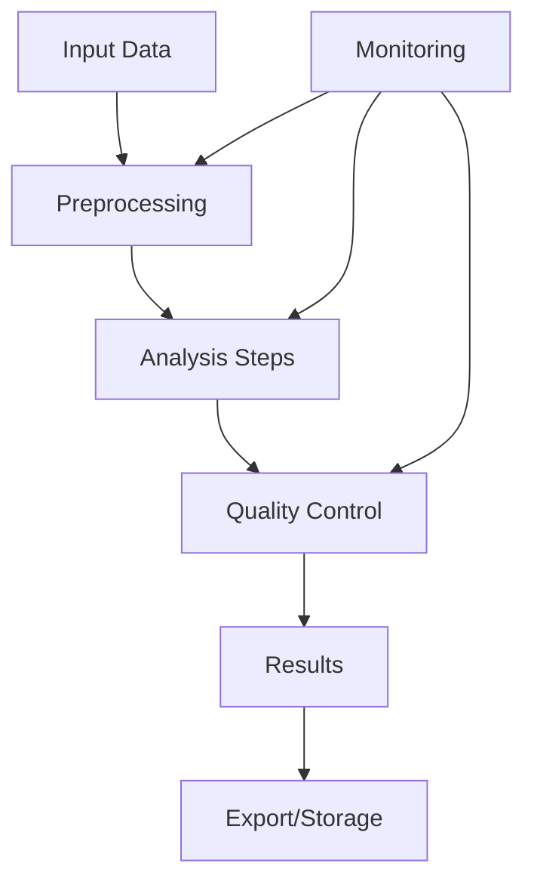

# Workflows in BASS

## Architecture Overview

The BASS-Cappella component implements a flexible workflow system, designed to handle complex bioinformatics pipelines while maintaining reproducibility and scalability. The workflow system integrates seamlessly with both the data storage and user interface components while being capable of operating independently...

See the [BASS-Cappella Installation Guide](installation.md) for instructions on how to install and configure BASS-Cappella.

## Core Workflow Features

### Pipeline Management
- Standardized pipeline creation and execution
- Support for both sequential and parallel execution
- Real-time monitoring and logging
- Error handling and recovery mechanisms
- Version control for workflow definitions
- Reproducible execution environments

### Integration Capabilities
- Direct integration with BASS-Hippo for data management
- Support for common bioinformatics tools
- Custom tool integration through plugin system
- Connection to high-performance computing (HPC) environments
- Container support (Docker, Singularity)

## Workflow Types

### Standard Workflows
- Pre-configured pipelines for common analyses
- Quality control and preprocessing
- Sequence alignment and assembly
- Variant calling and annotation
- Expression analysis
- Proteomics analysis

### Custom Workflows
- Visual workflow builder
- Custom script integration
- Parameter configuration
- Resource allocation management
- Dependency management
- Conditional execution paths

## Workflow Structure

## Execution Environment

### Resource Management
- Automatic resource allocation
- Queue management
- Priority handling
- Load balancing
- Resource monitoring
- Cost optimization

### Scalability
- Horizontal scaling for parallel execution
- Cloud infrastructure support
- On-premise deployment options
- Hybrid execution environments
- Dynamic resource allocation

## Reproducibility

### Environment Control
- Containerized execution
- Environment versioning
- Package management
- Dependency tracking
- Configuration management

### Provenance Tracking
- Complete workflow history
- Input/output versioning
- Parameter logging
- Execution timestamps
- User attribution
- Environment snapshots

## Best Practices

### Workflow Design
- Modular component structure
- Error handling implementation
- Resource specification
- Input validation
- Output standardization
- Documentation requirements

### Performance Optimization
- Parallel execution strategies
- Data locality optimization
- Resource allocation guidelines
- Caching mechanisms
- Pipeline benchmarking

## Integration with BASS Components

### BASS-Hippo Integration
- Automated data retrieval
- Result storage
- Metadata management
- Version control
- Access control

### BASS-Aperture Integration
- Workflow monitoring interface
- Parameter configuration
- Progress tracking
- Result visualization
- Error reporting

### BASS-Bridge Integration
- Cross-component communication
- Authentication handling
- Resource coordination
- Status synchronization
- Event management

## Configuration

### System Requirements
- Compute resources
- Storage requirements
- Network configuration
- Container runtime
- Authentication setup

### Customization Options
- Execution environment settings
- Queue configuration
- Resource limits
- Monitoring parameters
- Notification settings
