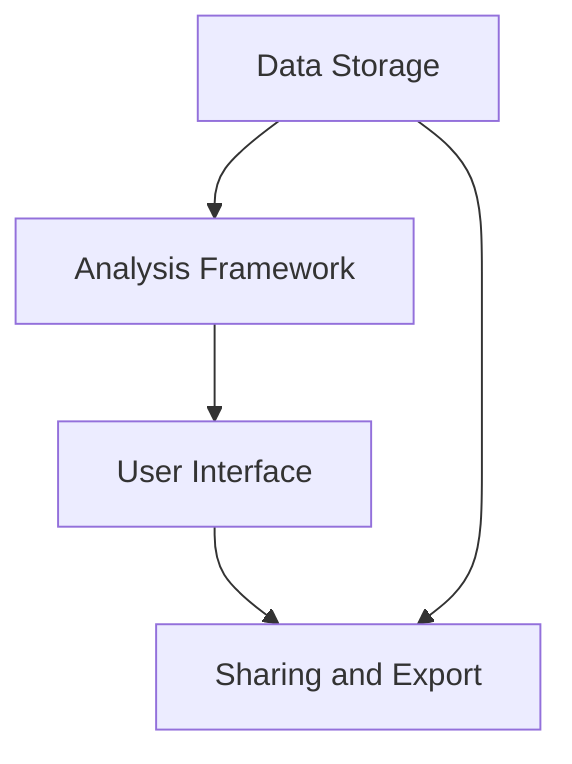

# System Architecture

## Main Software Components

DataHelix is structured around several core components that work together to provide a comprehensive bioinformatics analysis platform:

- **Data Storage**: Efficiently manages large-scale biological data, supporting common bioinformatics file formats and ensuring data provenance and version control.
- **Analysis Framework**: Facilitates the creation and execution of standardized pipelines, integrating with popular bioinformatics tools to ensure reproducible workflows.
- **User Interface**: Offers both a command-line interface for advanced users and a web-based interface for broader accessibility, along with API access for programmatic control.
- **Sharing and Export**: Provides capabilities for exporting data in standard formats and includes collaboration features that adhere to FAIR principles.

This architecture ensures that DataHelix is both flexible and scalable, allowing users to efficiently manage and analyze biological data while facilitating collaboration and data sharing.
